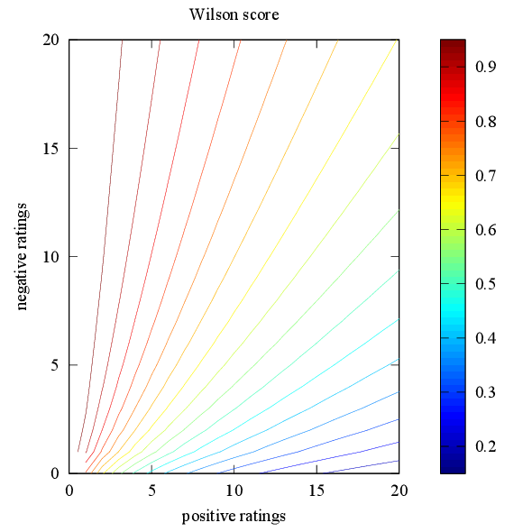

Wilson score
============

A score is computed for each word according to the lower bound of the Wilson
score confidence interval. See
[here](http://www.evanmiller.org/how-not-to-sort-by-average-rating.html) for
an introduction.

The score is

    score = ( f + z^2/2n + z * sqrt( ( f(1-f) + z^2/4n )/n ) ) / ( 1 + z^2/n)

where `n` is the number of attempts, `f` is the fraction of attempts which
resulted in success and `z` is the quantile function,

    z(p) = sqrt(2) erf⁻¹(p)

(Note that Wikipedia uses `erf⁻¹(2p-1)`; however, the Wilson score uses `z(1-α/2)`,
(`α ≡ 1-p`), so it all cancels out.)

The Wilson score interval only applies when results are statistically
independent, which is not the case. This isn't a study on language
acquisition, though, so I'll ignore that...

Confidence
==========

The lower-bound confidence used throughout this document is `p`. Choice of `p`
determines two things:

* Using higher `p` increases non-linearity of results: under high p, a few early
  correct results can give a very score; under low `p`, the score is similar to
  the fraction `negative/total`.
* Using higher `p` decreases the range between results (in the body of the plot),
  so poorly-known words will appear only a little more often than well-known
  ones.

I propose using 2σ-confidence: `p = 0.95`.

Word weighting
==============

Each word is weighted according to its Wilson score. Words that have been seen
fewer than three times are assigned a score of 0.8, to prevent division by 0
and early biasing.

Meta-weighting
==============

Initially, only words from the first chapter can be selected. The maximum
chapter increases when the fraction of available words with score less than 0.6
exceeds `p`.

A secondary weighting may be applied after score calculations to reduce the
weight of words from previous chapters. Alternatively, the score can increase
slowly according to the time elapsed since the word last appeared.
